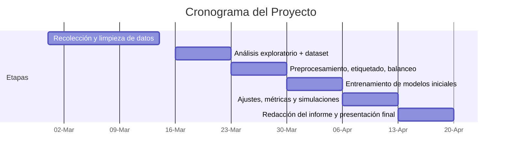

Pasar notas de cuantica a quarto para ver que onda con eso.

```mermaid
gantt
    title Cronograma del Proyecto
    dateFormat  YYYY-MM-DD
    axisFormat  %d-%b
    section Etapas
    Recolección y limpieza de datos     :a1, 2025-02-28, 14d
    Análisis exploratorio + dataset     :a2, 2025-03-16, 7d
    Preprocesamiento, etiquetado, balanceo :a3, 2025-03-23, 7d
    Entrenamiento de modelos iniciales  :a4, 2025-03-30, 7d
    Ajustes, métricas y simulaciones    :a5, 2025-04-06, 7d
    Redacción del informe y presentación final :a6, 2025-04-13, 7d
```
