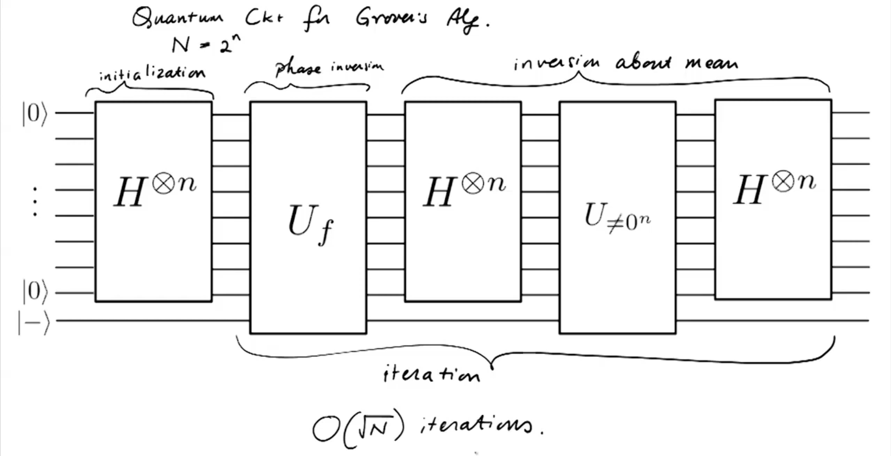
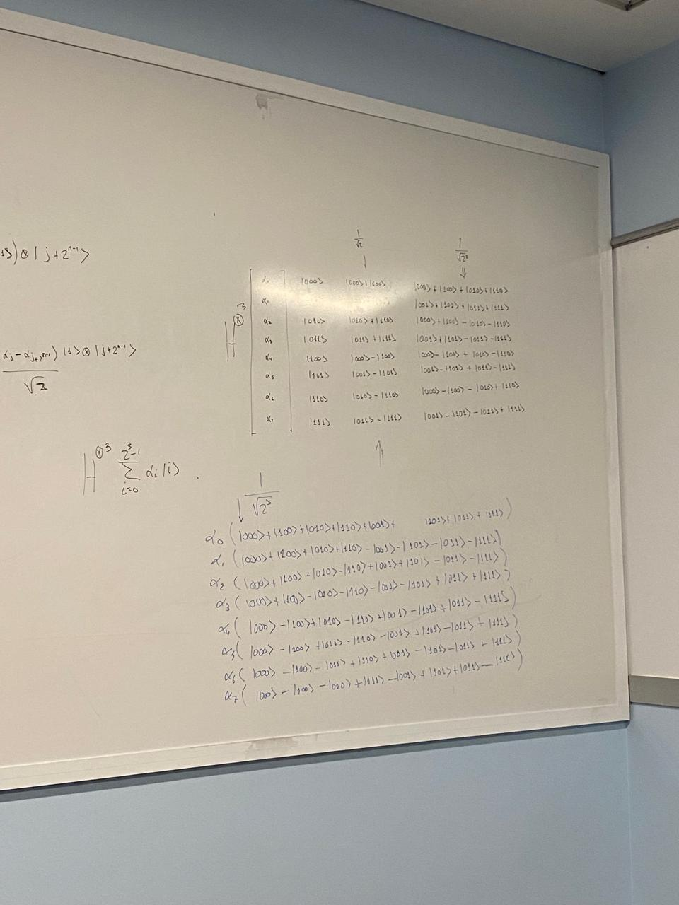

# Grover

[Grover Algorithm & Berkeley Playlist](https://www.youtube.com/watch?v=PAVKuYv1HC8&list=TLPQMDIwNDIwMjQ_6wzMabKaow&index=44 "La playlist también tiene vainos de QFT y algoritmo de Shor (Lecture 9)")

[Grover Algorithm en Qiskit](https://learning.quantum.ibm.com/tutorial/grovers-algorithm)

## Circuito principal

La parte de Phase Inversion consiste en una función oráculo que invierta la amplitud de $x^*$.

Hacer eso baja la media de f(x) de ahora en adelante.

Luego sigue Inversion about the mean. Calcular la media por alguna razón es fácil.

Proyección de la media $|u\rangle$ se hace así

se pasa de la media a 0 (hadamard 1)

se hace la proyección (unitaria sin 0)

se pasa de 0 a media (hadamard 2)

## $U_{\ne 0^{n}}$

Donde $U_{\ne0^{n}}$ en notación de dirac es $U_{\ne 0^n}=2|0\rangle\langle 0| - 1$ en forma de matriz es:

También función oráculo que mueva cosas alrededor de la media

aplicar $H^{\otimes 1}$ hace lo siguiente con las amplitudes.

$$
\begin{pmatrix}
  \alpha_0  \\
  \alpha_1 \\
  \vdots \\
  \alpha_{2^{n-1}-1}  \\ \\
  \alpha_{2^{n-1}} \\
  \alpha_{2^{n-1}+1} \\
  \vdots \\
  \alpha_{2^{n}}
\end{pmatrix}\rightarrow
\begin{pmatrix}
  \alpha_0 + \alpha_{2^{n-1}} \\
  \alpha_1 + \alpha_{2^{n-1}+1} \\
  \vdots \\
  \alpha_{2^{n-1}-1} + \alpha_{2^{n-1}-1} \\ \\
  \alpha_0 - \alpha_{2^{n-1}} \\
  \alpha_1 - \alpha_{2^{n-1}+1} \\
  \vdots \\
  \alpha_{2^{n-1}-1} - \alpha_{2^{n-1}-1}
\end{pmatrix}
$$

