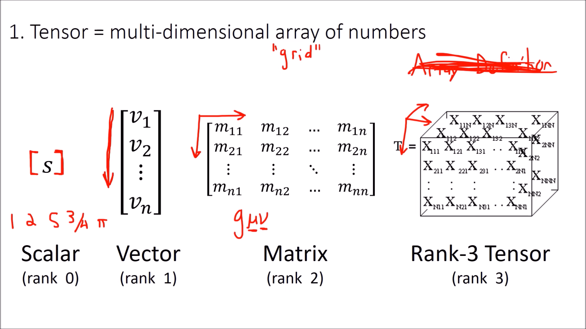

# Definiciones de un Tensor

## Una mala primera definición: Array definition

Arreglos multidimensionales de números.

Esto tiene el problema que ignoran el significado geométrico de los tensores but it's fine (para un ingeniero 🫠🫠)

## Una "mejor" definición incomprensible: Coordinate Definition

Un objeto que es invariante bajo cmabio de coordenadas, pero tiene componentes que si, en una forma "especial y predecible".

Sure, eso es español. Desglosemos:

### Invariante

Las cosas tienen propiedades intrínsecas y relativas. Un lapiz que está al lado de una puerta se puede decir que tiene la propiedad "al lado de una puerta" que va a depender (o ✨variar✨) según la posición del lapiz y la puerta. Cosas cómo la longitud del lapiz no van a variar entre sistemas de coordenadas i.e. es invariante respecto a las elecciones de sistemas de coordenadas.

### Componentes

Puedo describir "el lapiz" como una combinación lineal de vectores (o mejor dicho componentes) que si pueden variar bajo el sistema de coordenadas

#### Extra

El mapeo de una combinación bajo un sistema de coordenadas a otro (e inversa) es lo que ahora vamos a llamar una "forward (y "backward) transformation".

## "The good definition": Abstract

Una colección de vectores y covectores combinados entre sí con el tensor product (#TODO!).

Perfecto, no hace falta sino saber que son covectores y el tensor product y sale fácil. (Foreshadowing)

## Extra definition

Tensors as partial derivatives and gradients that transform with the jacobian matrix

Para cálculo servirá pero no me voy a meter con eso. Necesito llegar al Klonecker product y saber como escribir circledtimes antes del fin de semestre.
