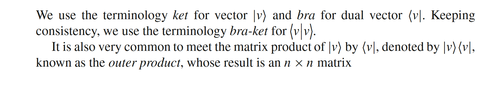
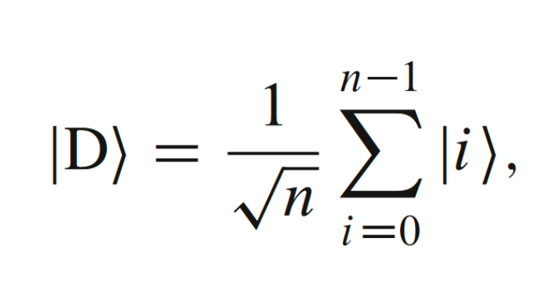
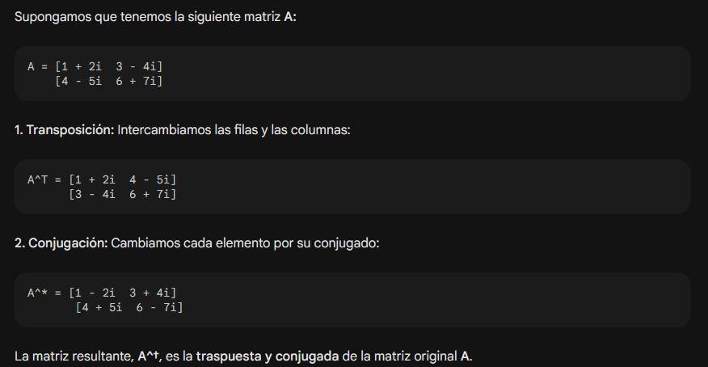
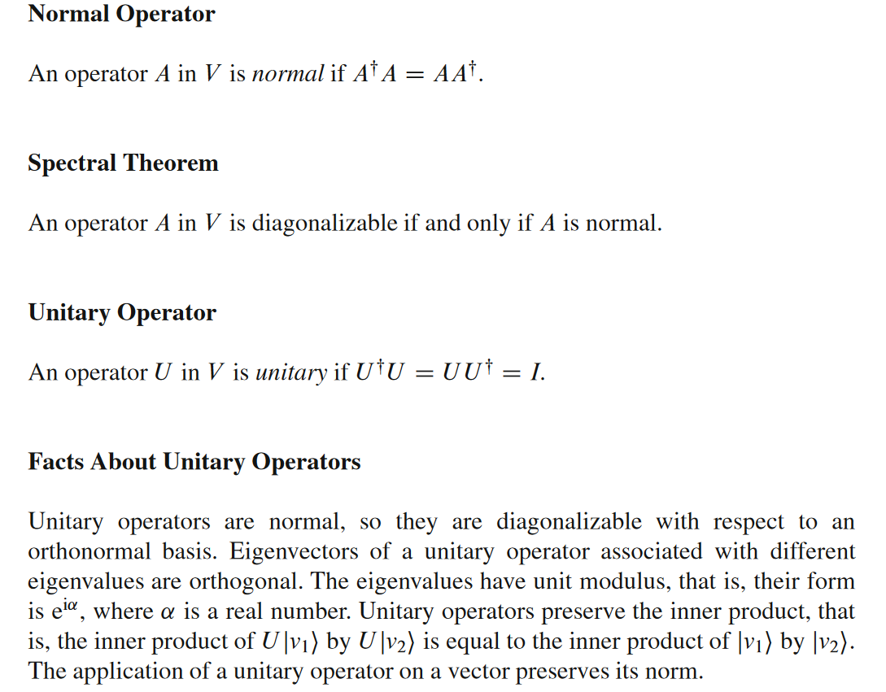
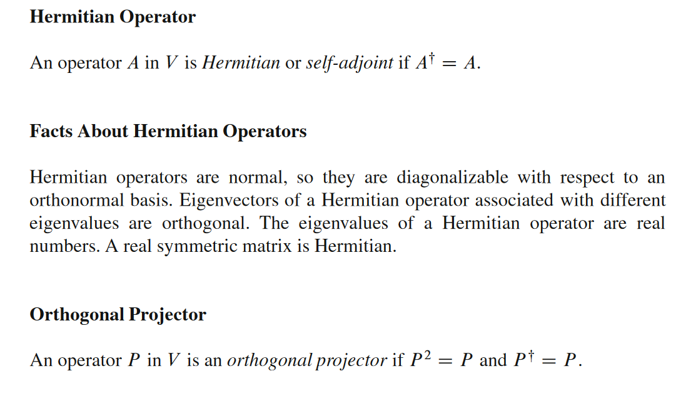
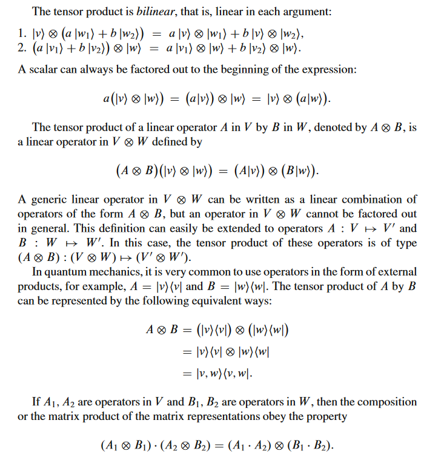

# Dirac

Vector en notacón dirac es así

\\( v \equiv \vert v \rangle \\)

Y el vector 0 es 0 :3

Colección de vectores es así
\\( \{ \vert v_0 \rangle, ...\vert \vert v_n \rangle\} \equiv \vert 0 \rangle, ... , \vert n \rangle \\)

El vector 0 es una excepción y no cambia de notación. 0 = 0 :3

El dual vector es
\\( \langle v \vert = [a_{1}^* \cdot \cdot \cdot a_n^*] \\)

El inner product es \\[ \langle v_1 \vert w_1 \rangle = \sum_{i=1}^n a_i^*a_i \\]

Y si tuvieramos una base ortonormal  \\( \{ \vert v_0 \rangle, ...\vert \vert v_n \rangle\} \\)  entonces
\\[ \langle v_i \vert v_j \rangle = \delta_{ij}, \\]

Y la norma de un vector \\(\lVert |v| \rVert = \sqrt{\langle v \vert v \rangle \}  \\)

El outer product de dos vectores se denota \\( \vert v \rangle \langle v \vert \\)

La base computacional de \\( \{ \vert 0, ... , \vert n-1 \rangle \} \\) tambien se le conoce como la base canónica. A veces va de 1 a n.

Y la suma normalizada de los vectores de la base computacional definen el vector \\( | D \rangle \\) llamado estado diagonal.

Y cuando n=2 \\[ \vert + \rangle = \frac{\vert 0 \rangle + \vert 1 \rangle}{\sqrt{2}} \\]

## Quibit y la Bloch Sphere

Un qubit es un vector unitario en un espacio vectorial \\(  \mathbb{C}^2 \\) y un qubit genérico \\(  \vert \psi \rangle  \\) se representa con: \\(  \vert \psi \rangle = \alpha \vert 0\rangle +\beta \vert 1 \rangle \\)

donde alpha y beta, son las amplitudes de estado, cumplen \\(  |\alpha|^2 +|\beta|^2 = 1\\) y la base computacional es el set \\(  \{ |0\rangle,|1\rangle \}  \\)

Los términos de vector estado, o estado can a ser usados para significar `vector unitario en espacio de Hilbert`. SI transformamos la primera ecuación metiendo la segunda y haciendo una segunda transformación, un qubit se puede definir con solo 2 números reales. (Se lee que psi depende de phi y theta btw) \\( \psi(\phi, \theta) \\)

\\[ |\psi\rangle = cos\frac{\theta}{2}|0\rangle + e^{i\phi} sin\frac{\theta}{2}sin|1\rangle  \\]

Y los componentes de un vector en la Bloch Sphere se ven así.

\\[ \begin{align}  x=\begin{bmatrix} sin\theta cos\phi & sin\theta sin\phi & cos\theta \end{bmatrix}^T \label{vectorLatex} \end{align} \\]

# Operadores lineales

Estos tienen representación matricial, y por tanto cuando se habla de operadores se puede hablar de algunas matrices.

## Operadores especiales

A parte,

Como las matrices de Pauli  unitarias y son hermitian,

 o \\( A^{\dag}=A \\), también aplican las propiedades que son normal \\( A^{\dag}A=AA^{\dag} \\), y por tanto diagonalizable. Y por ser unitarias los valores propios son \\( \pm 1 \\)

 

## Operator Functions

Whole new world
AAAAAAAAAAAAAAAAAAAAAAAAAAAAAAAAAAAAAAAAAAAAAAAAAAAAAAAAAAAAAAA

## Tensor Product y Kronecker Product

