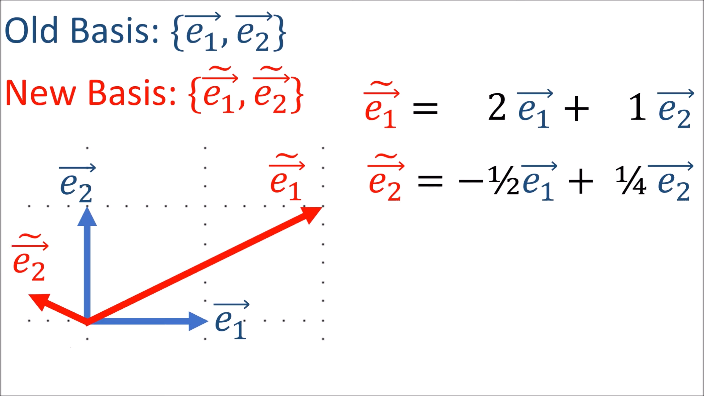
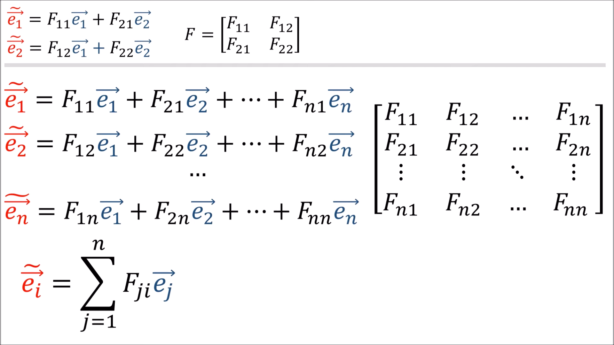
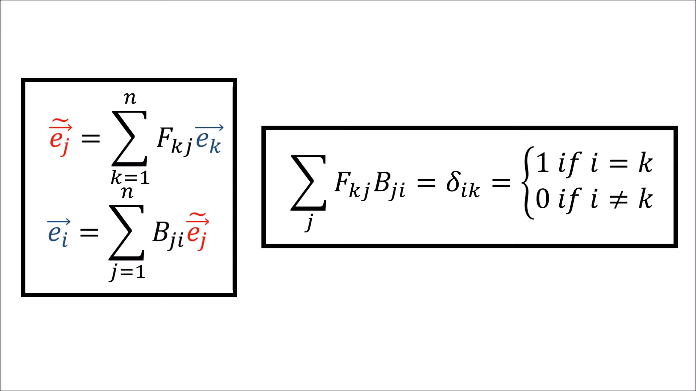

# Transformations

## Forward

Tratamos de construir ecuaciones de los nuevos vectores base a partir de los viejos.

Luego,  construimos una matriz F a partir esas ecuaciones.



## Backwards


Literal es lo mismo pero tratando de contruir los viejos a partir de los nuevos. Isomorfismo? Cosas? Siento que es algo que se podría buscar...

Anyway.

Si tomamos FB creo que tenemos identidad?

osea

\\( B=F^{-1} \\)

```rust
# // SIUUUUUUUUUUUUUUUUUUUU 
```

## Generalizando a n-dims

F se podría también indicar como suma así:



Haciendo lo mismo con B y haciendo FB pero con sumas...


Once again, alcanzamos una nueva expresion que tiene que tener bounds para que los elementos si sean consistentes (que terminan siendo la matriz identidad).


Entonces? Formas de expresar Forward y Backward transformations y que una de ellas es inversa de la otra. Ah, y el Kronecker Delta. \\( \delta_{ik}\\)

