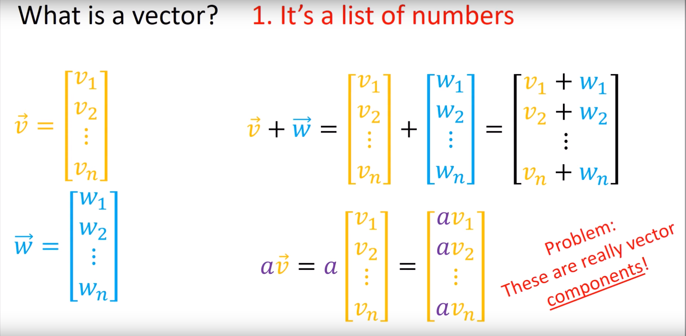

# Vector definition

First _example_ of a tensor is a vector

So, according to the prevoius ones, a definition of a vector could be

1. A list of numbers, with some operations defined: 
   1. Sum of vectors is element-wise.
   1. `scalar*vector` scales all components of vector.
   1. This again ignores geometric meaning so its useless. Also ignores that, vectors, because they are tensors, are invariant while their components are not 
   
1. It's like an arrow. With some operations defined:
   1. Adding arrows is like putting tip of an arrow at the tail of the other (commutatively, for this type of sum) and the resulting vector is where you end up (Math!).
   1. `scalar*vector` scales the arrow. Negative scalars also flip the arrow (180°) although not all vectors can be arrows, this is some euclidian geometry bound BS (Bound Space).
1. Member of a vector space. Where \\( Vector\ Space:=(V,S,+,\cdot) \\) where vectors can be added together and they can scale.

## Transformations
 
Como funcionanban las cosas con vectores base es que si uno tiene dos pares de vectores base \\((v_1,v_2)\ a\ (n_1,n_2)\\), uno pasa de uno a otro con \\(F\cdot v_i=n_i | B\cdot n_i=v_i \\) sin embargo como se ve en la figura, como se mueven los vectores pertenecienetes a un cambio de base se mueven de forma opuesta a los vectores base bajo las mismas matrices de transformación.

Por eso, para vectores \\(\in v_i\\) lo que resulta como consecuencia de las matrices es que los vectores en un sistema de coordenadas  se mueven al revés de como se mueven los vectores base, o sea, \\(B\cdot v_i=n_i | F\cdot n_i=v_i\\), o sea, son contravariantes.

Estas fórmulas resumen como se da un cambio de base entre vectores base y como se da en vectores que pertenecen al sistema de coordenadas de esas bases. 
